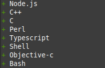

# Language Checker



Language Checker is a Python application designed to scan your computer for coding languages and display the results in the console.

## Requirements

Make sure you have [Python](https://www.python.org) installed on your system.

### Installation

```sh
git clone https://github.com/Zilonis123/language-checker/ && cd language-checker/
```

```sh
pip install -r requirements.txt
```

### Usage

To run the application, use the following command:

```sh
python main.py
```

## Flags / Instructions

For a detailed list of commands and flags, run:

```sh
python main.py -h
```

## Contributing

Your contributions are welcome! If you have suggestions to enhance the project, feel free to fork the repository and create a pull request. Alternatively, you can open an issue with the tag "enhancement". Don't forget to star the project if you find it useful!

1. Fork the Project
2. Create your Feature Branch (`git checkout -b feature/AmazingFeature`)
3. Commit your Changes (`git commit -m 'Add some AmazingFeature'`)
4. Push to the Branch (`git push origin feature/AmazingFeature`)
5. Open a Pull Request
